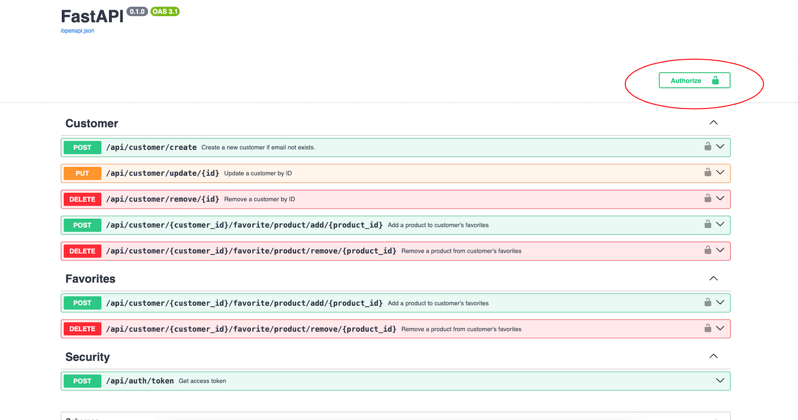
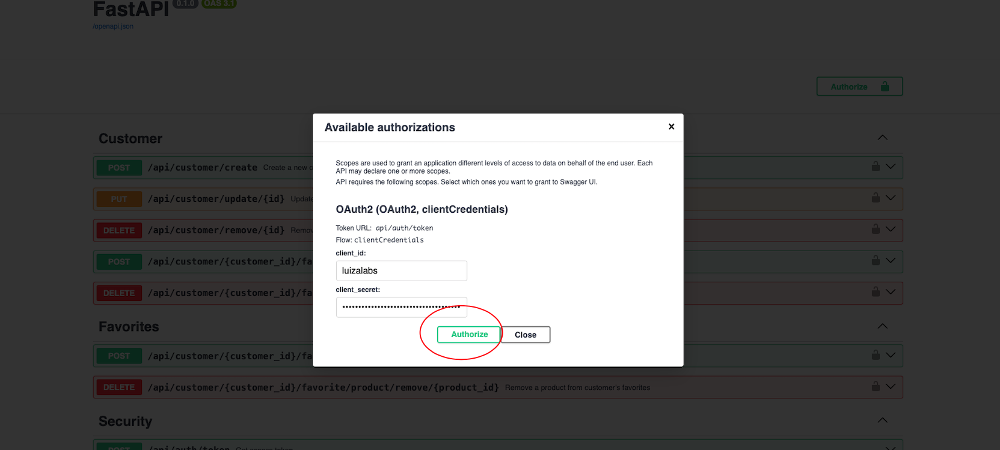

# luizalabs-backend-challenge

# Requisitos
1. makefile
2. docker
3. docker-compose
4. python
5. pip

# Passo 1: Instalação de bibliotecas
Para realizar as instalações das bibliotecas execute:<br>
`make install`

# Passo 2: Iniciando a api
Para iniciar a api rode:<br>
`make start`<br>
Irá rodar o docker-compose e logo em seguida irá rodar a api<br>

# Passo 3: Acessando a doc
1. [Swagger](http://localhost:8000/docs)
2 . [Redoc](http://localhost:8000/redoc)

# Passo 4: Autenticação utilizando o fluxo Oauth2 Client Credentials
### Client Credentials é um fluxo para autenticação entre serviços, devido a isso foi criado um usuário fixo no momento
*Usuario fixo:* <br>
**client_id** <br>
`luizalabs` <br>
**client_secret** <br>
`2d217d9b58e59fb6f3e2ad82e52c3ffe98da318b19594708fd9ed0528f3eb73a` <br>



# Passo 5: Utilizando a api
Após autenticado você poderá utilizar todos endpoints
---
Fluxo simples de uso: 

1. /api/customer/create
2. /api/customer/{customer_id}/favorite/product/add/{product_id}

Você precisa pegar o id do customer criado no passo 1 e colocar no passo 2 <br>
No passo 2 você pode utilizar os seguintes id de produtos que foram mocados para adicionar na lista do cliente:<br>
```
51150cf9-2f86-4bc9-bd71-4cfccca5d111
85aafccb-44bf-4bff-b66c-f9581eb96742
8a9a59b9-5c8e-4dc4-8260-ac4a3699bccc
```
---
# Code
## Chaves no arquivo .env e docker-compose.yml
Deixei as chaves configuradas apenas para ambiente local, em uma publicação, deve-se setar as seguintes váriaveis de ambiente:
```
SECURITY_OAUTH2_JWT_SECRET="xx"
SECURITY_OAUTH2_ACCESS_TOKEN_EXPIRE_MINUTES=30
SECURITY_OAUTH2_JWT_ALGORITHM="HS256"
CLIENT_ID="xx"
CLIENT_SECRET="xx"
USE_IN_MEMORY=0
MONGODB_URL="xx"
MONGODB_USERNAME="xx"
MONGODB_PASSWORD="xx"
MONGODB_DB="xx"
```

# TODO Itens a melhorar: 
1. Logs
2. Conexão com a api [api de produtos](https://gist.github.com/Bgouveia/9e043a3eba439489a35e70d1b5ea08ec)
